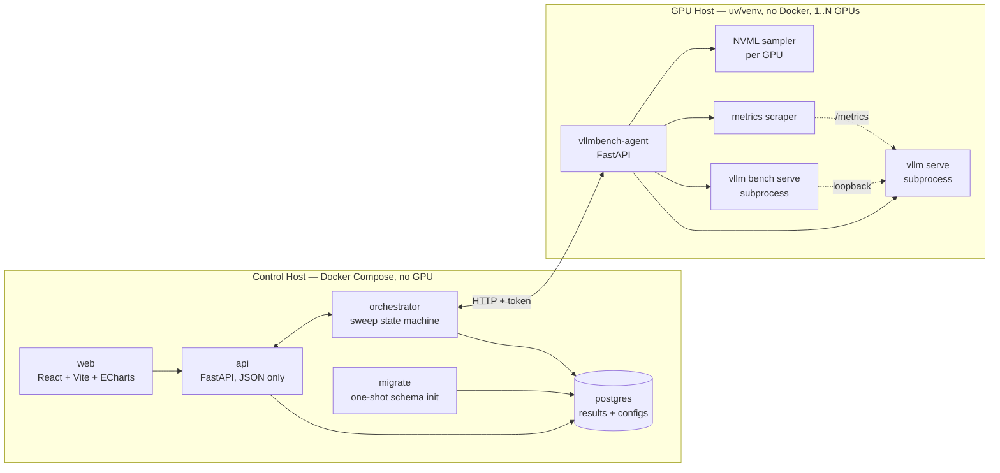

# vLLM Benchmarking Framework

Standard work and tooling for measuring, recording, and tuning inference performance of
locally-hosted large language models served by [vLLM](https://docs.vllm.ai/).

This project wraps the [vLLM Benchmark CLI](https://docs.vllm.ai/en/v0.25.1/benchmarking/)
with the things it does not provide: durable result storage, run history, cross-sweep
comparison, configuration lineage, and a visual interface for parameter tuning.

> **Status:** 1.0.0rc1 — release candidate. See [ROADMAP.md](ROADMAP.md) for what remains.

---

## What problem this solves

`vllm bench serve` produces a JSON blob and exits. `vllm bench sweep serve` produces a
directory of JSON blobs and PNGs. Neither remembers what you ran last week, neither lets
you ask "which `max_num_seqs` gave the best per-GPU throughput at p99 TTFT under 200ms,"
and neither tells you *why* a configuration lost.

This framework:

- **Designs** sweeps as a matrix of server configs × workloads, authored in a UI.
- **Runs** them against a real vLLM server it starts and stops per configuration.
- **Records** benchmark results, engine telemetry, and GPU telemetry to PostgreSQL.
- **Displays** them as Pareto frontiers, saturation curves, and per-run timelines.
- **Stores** server configurations as native vLLM YAML, directly usable with `vllm serve --config`.
- **Exposes** all of the above over MCP, so Claude Code and similar agent harnesses can
  drive a tuning loop directly. See [ADR 0001](docs/adr/0001-mcp-server-interface.md).

---

## Architecture

The stack is split across two hosts by design. The control plane carries no GPU
dependency and imposes no measurable load on the system under test.



### Why this split

| Decision | Rationale |
| --- | --- |
| Control plane on a separate host | Keeps the system under test quiet. No database, web server, or browser competing for CPU during a measurement. |
| Benchmark client on the **GPU host**, over loopback | Network RTT and jitter never enter the TTFT/ITL numbers. Results stay directly comparable to published vLLM figures. |
| Agent is a uv package, not a container | The agent must invoke the venv's own `vllm` binary. Installing it into that environment means **no container runtime is required on the GPU host**. |
| Framework owns the sweep loop | `vllm bench serve` is the atomic unit; orchestration is ours. This buys live progress, mid-sweep cancellation, per-run streaming into Postgres, and telemetry interleaved with each run. |
| Configs stored as vLLM YAML | vLLM accepts `--config file.yaml` natively. No lossy translation layer between what you see and what runs. |

---

## What gets measured

### Benchmark results
Captured from `vllm bench serve --save-result`:

- Throughput — requests/sec, output tokens/sec, total tokens/sec
- **TTFT** — time to first token, mean / median / p99
- **TPOT** — time per output token, mean / median / p99
- **ITL** — inter-token latency, mean / median / p99
- Request counts, token counts, benchmark duration

### Engine telemetry
Sampled from the vLLM `/metrics` Prometheus endpoint for the duration of each run:

- KV cache utilization
- Prefix cache hit rate
- Running / waiting queue depth
- Preemption counts

### GPU telemetry
Sampled via NVML for **every GPU** participating in the run, attributed per device:

- SM utilization, memory used, power draw, temperature, clock speeds

Per-device attribution is what makes tensor parallelism analyzable. A TP=4 run where one
device sits at 60% utilization while three sit at 95% is telling you something a
host-level average would hide entirely.

The last two categories are the point. A p99 TTFT number tells you a configuration lost.
KV cache pressure and queue depth tell you *why*, which is what makes the next
configuration better instead of merely different.

---

## Prerequisites

### Control host
- Docker and Docker Compose v2 — native Linux or macOS with [Colima](https://github.com/abiosoft/colima)
- No GPU required

On macOS, Colima's defaults are too small to run the stack alongside the CPU-backend test
container. Start it with more headroom:

```bash
colima start --cpu 4 --memory 8 --disk 60
```

### GPU host
- One or more NVIDIA GPUs on a single host, with a working driver
- Python environment managed by `uv` with vLLM installed
- Network reachability from the control host on the agent port

Single-host multi-GPU is supported, and **tensor parallel size is a first-class sweep
dimension** — "is TP=2 on two GPUs better than two independent TP=1 servers" is a question
this framework exists to answer. Multi-node deployments are out of scope for 1.0.0.

---

## Quick start

Three steps: bring up the control plane, install the agent on the GPU host, take a
measurement. Verified end to end from a clean control host and a GPU host with no agent
installed.

### 1. Control plane

```bash
git clone https://github.com/er0080/vllm-benchmarking
cd vllm-benchmarking
cp .env.example .env
```

Edit `.env` and set two values:

- `VLLMBENCH_TOKEN` — the shared secret with the agent.
  Generate one with `python3 -c 'import secrets; print(secrets.token_urlsafe(32))'`.
- `VLLMBENCH_AGENT_URL` — the LAN address of the GPU host, e.g. `http://192.168.1.50:9110`.
  Not `localhost`: the control plane runs on a different machine by design.

```bash
docker compose up -d
```

This builds the images, applies the schema and starts five services. Check it:

```bash
curl -s localhost:8000/api/health   # {"status":"ok", ... "schema":{"ok":true, ...}}
```

Then open <http://localhost:8080>.

### 2. Agent, on the GPU host

Install it **into the vLLM environment**, from git:

```bash
source /path/to/vllm-env/.venv/bin/activate
uv pip install "git+https://github.com/er0080/vllm-benchmarking@v1.0.0rc1#subdirectory=packages/agent"
```

Give it the same token, in a file rather than on a command line where `ps` can read it,
and start it:

```bash
umask 077 && echo "VLLMBENCH_TOKEN=the-token-from-step-1" > ~/.vllmbench-agent.env
set -a; . ~/.vllmbench-agent.env; set +a; vllmbench-agent
```

```bash
curl -s localhost:9110/health
```

That is enough to take a measurement. Running it as a service, upgrading it, and the
environment facts that cost the most time — chiefly that a service does not inherit the
`HF_HOME` you set in `~/.bashrc`, so vLLM re-downloads weights the host already has — are
in [docs/agent-installation.md](docs/agent-installation.md).

### 3. Your first measurement

In the UI:

1. **Hosts → Register.** Give it a name and the agent URL. The handshake reads the host's
   facts, and per-device GPU model, VRAM, driver, CUDA and vLLM version appear. Those
   become provenance on every run this host produces.
2. **Runs.** Pick the host. Config and workload can both be authored inline the first
   time — leave each dropdown on "New from…" and fill in the fields below it:

   ```yaml
   model: facebook/opt-125m
   max_model_len: 2048
   gpu_memory_utilization: 0.30
   tensor_parallel_size: 1
   ```

   A workload of 20 prompts at concurrency 4 is enough to prove the path. Start it.
3. Watch it move through `starting` and `benchmarking`, then open the run. TTFT, TPOT, ITL
   and per-GPU throughput are in Postgres, with the raw benchmark payload kept verbatim
   beside them and a per-second telemetry timeline underneath.

On a small model this takes about ninety seconds end to end.

The config you just wrote is now content-addressed and reusable. The **Configs** tab is
where configs get validated before they cost GPU time, annotated with the run that
justifies them, and exported — the bytes are identical to what ran, so they go straight
into production.

From there: **Sweeps** authors a matrix of configs × workloads with replicates, and the
analysis tabs chart the results. What each chart means and what to change next is
[docs/tuning-playbook.md](docs/tuning-playbook.md).

### Without a GPU

The stack is fully developable on a laptop. `docker compose --profile dev up` adds a mock
agent that implements the agent's HTTP contract and returns synthetic but realistic results
and telemetry, with configurable failure injection. Everything it produces is marked
synthetic at the moment of creation and can never be charted beside a real measurement.

---

## Documentation

- [ROADMAP.md](ROADMAP.md) — milestones, scope, and definition of done for 1.0.0
- [CLAUDE.md](CLAUDE.md) — architecture invariants and development conventions
- [docs/agent-installation.md](docs/agent-installation.md) — installing, running and upgrading the agent on a GPU host
- [docs/tuning-playbook.md](docs/tuning-playbook.md) — how to read each chart and what to change next
- [docs/upgrading.md](docs/upgrading.md) — moving a running deployment forward, and what cannot be rolled back
- [docs/limitations.md](docs/limitations.md) — what this release does not do
- [docs/adr/](docs/adr/) — accepted architecture decisions and the alternatives they rejected
- [docs/hardware-verification.md](docs/hardware-verification.md) — what real hardware found, and what it confirmed
- [vLLM Benchmark CLI](https://docs.vllm.ai/en/v0.25.1/benchmarking/cli/) — upstream reference
- [vLLM Parameter Sweeps](https://docs.vllm.ai/en/v0.25.1/benchmarking/sweeps/) — upstream sweep tooling
