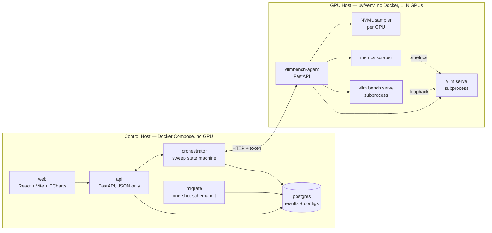

# vLLM Benchmarking Framework

Standard work and tooling for measuring, recording, and tuning inference performance of
locally-hosted large language models served by [vLLM](https://docs.vllm.ai/).

This project wraps the [vLLM Benchmark CLI](https://docs.vllm.ai/en/v0.25.1/benchmarking/)
with the things it does not provide: durable result storage, run history, cross-sweep
comparison, configuration lineage, and a visual interface for parameter tuning.

> **Status:** pre-release. See [ROADMAP.md](ROADMAP.md) for the path to 1.0.0.

---

## What problem this solves

`vllm bench serve` produces a JSON blob and exits. `vllm bench sweep serve` produces a
directory of JSON blobs and PNGs. Neither remembers what you ran last week, neither lets
you ask "which `max_num_seqs` gave the best per-GPU throughput at p99 TTFT under 200ms,"
and neither tells you *why* a configuration lost.

This framework:

- **Designs** sweeps as a matrix of server configs × workloads, authored in a UI.
- **Runs** them against a real vLLM server it starts and stops per configuration.
- **Records** benchmark results, engine telemetry, and GPU telemetry to PostgreSQL.
- **Displays** them as Pareto frontiers, saturation curves, and per-run timelines.
- **Stores** server configurations as native vLLM YAML, directly usable with `vllm serve --config`.
- **Exposes** all of the above over MCP, so Claude Code and similar agent harnesses can
  drive a tuning loop directly. Planned for 0.6.0; see [ADR 0001](docs/adr/0001-mcp-server-interface.md).

---

## Architecture

The stack is split across two hosts by design. The control plane carries no GPU
dependency and imposes no measurable load on the system under test.



### Why this split

| Decision | Rationale |
| --- | --- |
| Control plane on a separate host | Keeps the system under test quiet. No database, web server, or browser competing for CPU during a measurement. |
| Benchmark client on the **GPU host**, over loopback | Network RTT and jitter never enter the TTFT/ITL numbers. Results stay directly comparable to published vLLM figures. |
| Agent is a uv package, not a container | The agent must invoke the venv's own `vllm` binary. Installing it into that environment means **no container runtime is required on the GPU host**. |
| Framework owns the sweep loop | `vllm bench serve` is the atomic unit; orchestration is ours. This buys live progress, mid-sweep cancellation, per-run streaming into Postgres, and telemetry interleaved with each run. |
| Configs stored as vLLM YAML | vLLM accepts `--config file.yaml` natively. No lossy translation layer between what you see and what runs. |

---

## What gets measured

### Benchmark results
Captured from `vllm bench serve --save-result`:

- Throughput — requests/sec, output tokens/sec, total tokens/sec
- **TTFT** — time to first token, mean / median / p99
- **TPOT** — time per output token, mean / median / p99
- **ITL** — inter-token latency, mean / median / p99
- Request counts, token counts, benchmark duration

### Engine telemetry
Sampled from the vLLM `/metrics` Prometheus endpoint for the duration of each run:

- KV cache utilization
- Prefix cache hit rate
- Running / waiting queue depth
- Preemption counts

### GPU telemetry
Sampled via NVML for **every GPU** participating in the run, attributed per device:

- SM utilization, memory used, power draw, temperature, clock speeds

Per-device attribution is what makes tensor parallelism analyzable. A TP=4 run where one
device sits at 60% utilization while three sit at 95% is telling you something a
host-level average would hide entirely.

The last two categories are the point. A p99 TTFT number tells you a configuration lost.
KV cache pressure and queue depth tell you *why*, which is what makes the next
configuration better instead of merely different.

---

## Prerequisites

### Control host
- Docker and Docker Compose v2 — native Linux or macOS with [Colima](https://github.com/abiosoft/colima)
- No GPU required

On macOS, Colima's defaults are too small to run the stack alongside the CPU-backend test
container. Start it with more headroom:

```bash
colima start --cpu 4 --memory 8 --disk 60
```

### GPU host
- One or more NVIDIA GPUs on a single host, with a working driver
- Python environment managed by `uv` with vLLM installed
- Network reachability from the control host on the agent port

Single-host multi-GPU is supported, and **tensor parallel size is a first-class sweep
dimension** — "is TP=2 on two GPUs better than two independent TP=1 servers" is a question
this framework exists to answer. Multi-node deployments are out of scope for 1.0.0.

---

## Quick start

**On the GPU host**, install the agent **into the vLLM environment**, from git:

```bash
source /path/to/your/vllm-env/.venv/bin/activate
uv pip install "git+https://github.com/er0080/vllm-benchmarking@main#subdirectory=packages/agent"

VLLMBENCH_TOKEN=... vllmbench-agent
```

Install from git rather than from a local clone. `vllmbench-protocol` is a workspace
member, so inside a checkout `uv pip install ./packages/agent` resolves it through
`tool.uv.sources` and installs it **editable** — a `.pth` file pointing back at the
checkout. Nothing complains, and the agent works until the clone is moved or deleted,
at which point it dies with `ModuleNotFoundError: vllmbench_protocol`. Installing from
git resolves the same workspace inside a throwaway clone and installs both packages
normally, pinned to a commit that `pip show`/`direct_url.json` records — which is
better provenance than a directory path anyway.

Replace `@main` with a milestone tag (`@v0.3.0`) to pin a GPU host to a known commit.

Installing into the vLLM environment rather than beside it is deliberate, and it adds
nothing: vLLM's server is itself a FastAPI and uvicorn application using pydantic,
psutil and NVML, so every one of the agent's dependencies is already present. Only the
two small pure-Python packages above get added.

Verify the install is self-contained — this is the check that would have caught the
editable-install trap:

```bash
python -c "import vllmbench_agent, vllmbench_protocol; print(vllmbench_protocol.__version__)"
ls "$VIRTUAL_ENV"/lib/python*/site-packages/_editable_impl_vllmbench_*.pth 2>/dev/null \
  && echo "NOT self-contained — reinstall from git"
```

If isolation is genuinely required — a shared host, an immutable environment — install
the agent elsewhere and set `VLLMBENCH_VLLM_BIN` to the absolute path of the `vllm`
executable. Do **not** solve it by putting the vLLM venv on `PATH`: that is invisible in
`ps`, silently lost across systemd units, tmux sessions and reboots, and when wrong it
yields a confusing null version rather than an error.

**On the control host**, bring up the stack:

```bash
cp .env.example .env      # set VLLMBENCH_AGENT_URL and VLLMBENCH_TOKEN
docker compose up -d
```

Open http://localhost:8080, register the GPU host, and author your first sweep.

---

## Documentation

- [ROADMAP.md](ROADMAP.md) — milestones, scope, and definition of done for 1.0.0
- [CLAUDE.md](CLAUDE.md) — architecture invariants and development conventions
- [docs/agent-installation.md](docs/agent-installation.md) — installing, running and upgrading the agent on a GPU host
- [docs/tuning-playbook.md](docs/tuning-playbook.md) — how to read each chart and what to change next
- [docs/upgrading.md](docs/upgrading.md) — moving a running deployment forward, and what cannot be rolled back
- [docs/limitations.md](docs/limitations.md) — what this release does not do
- [docs/adr/](docs/adr/) — accepted architecture decisions and the alternatives they rejected
- [docs/hardware-verification.md](docs/hardware-verification.md) — code paths built without a GPU and awaiting verification on real hardware
- [vLLM Benchmark CLI](https://docs.vllm.ai/en/v0.25.1/benchmarking/cli/) — upstream reference
- [vLLM Parameter Sweeps](https://docs.vllm.ai/en/v0.25.1/benchmarking/sweeps/) — upstream sweep tooling
